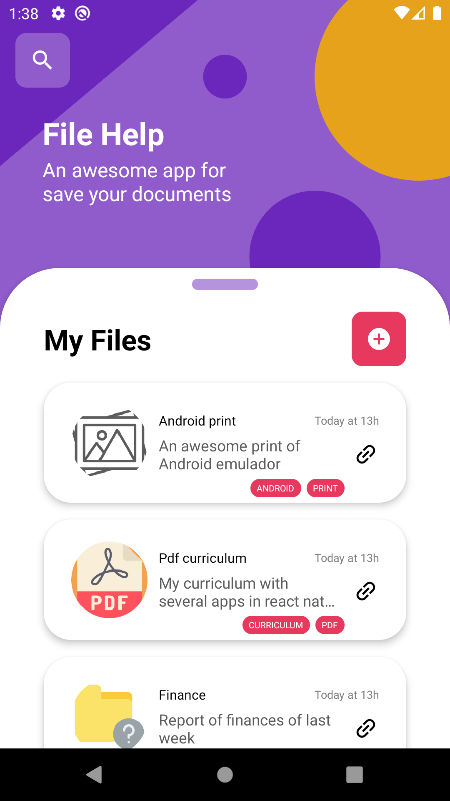
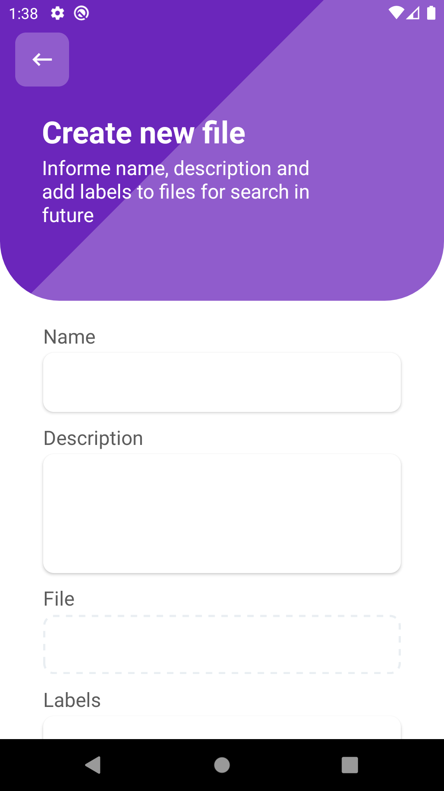
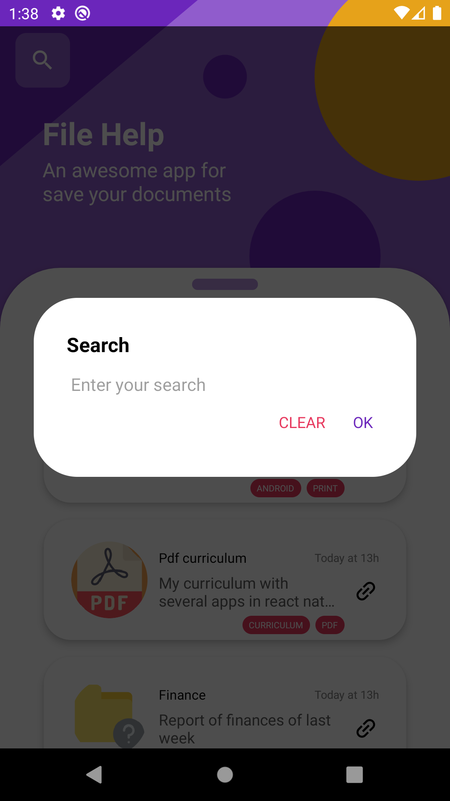
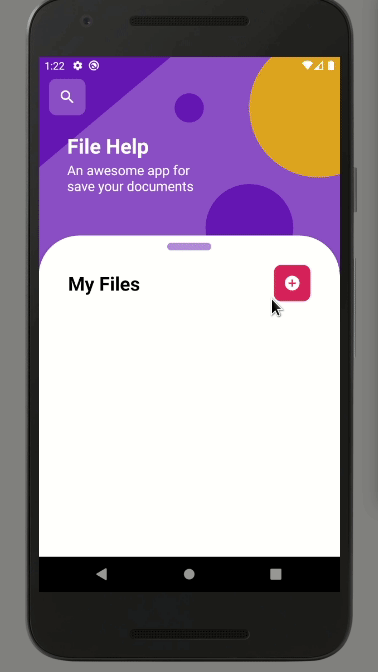
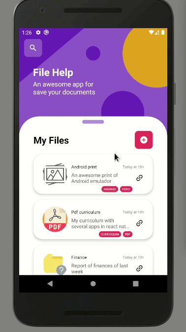
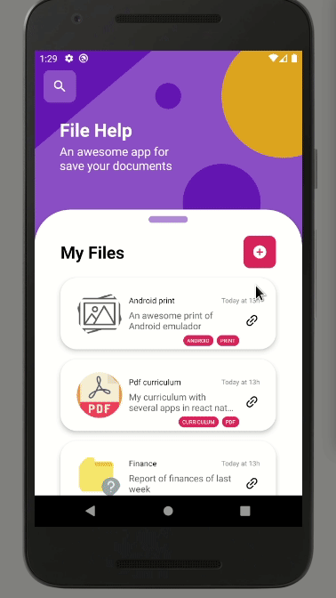

<h1 align="center">
  
</h1>

<h3 align="center">
  File Help
</h3>

<p align="center">
  An awesome app done in react-native for storage of files and search any time and view.
</p>

## 👨🏼‍💻 Development Contact

David Nascimento

- [Github](https://github.com/david32145)
- [Email](mail:nascimento32145@gmail.com)

## 🚶 User Stories

- An _user_ can do upload of files to server;
- For each file, the user can info an title, description and
an list of labels;
- The _user_ can search by title, description or tag in an unique field;
- The _user_ can open your file in browser.

## 🚀 Technologies

In the app was used an stack `javascript`, with `nodejs` in backend and `react-native` in mobile.

### ♻️ Backend

- nodejs;
- mysql;
- sequelize;
- multer;
- express;
- nodemon.

### 📳 Mobile

- react-native;
- typescript;
- axios;
- date-nfs;
- react-native-document-picker;
- react-native-modal;
- react-native-svg;
- react-navigation.

## 🎌 What I've learned

- Storage of files with nodejs and multer;
- Create, search and delete database instances;
- Migrations with sequelize;
- Relationship in tables of database;
- API RESTful with express;
- Upload of files with react-native and axios;
- Consumer the api resouces with axios;
- Manager files with react-native-document-picker;
- Manager class `FormData` for request of type `multpart/form-data`;
- React hooks;
- Context API and custom hooks;
- Liking with other applications.

## 🏘️ Examples

<h1 align="left">
  
</h1>
<h1 align="left">
  
</h1>
<h1 align="left">
  
</h1>

## 🎥 How Usage

Example how usage app.

### 🆕 Create New File

<h1 align="left">
  
</h1>

### 👽 Unknown file
<h1 align="left">
  
</h1>

### 😎 Open your file in browser
<h1 align="left">
  
</h1>

### 🔍 Search in your files
<h1 align="left">
  
</h1>

## ✋🏻 Prerequisites

- [Node.js](https://nodejs.org/en/)
- [Yarn](https://yarnpkg.com/pt-BR/docs/install)
- [Android Environment](https://developer.android.com/studio)

## 🔥 Install and Running

🥺 Obs. **Android** only.

1. Config you environment;
2. Create an new virtual device and run;
3. Git clone `git clone https://github.com/david32145/file-help.git`;
4. Enter in api folder;
5. Copy .env.example to .env and fill with your config, in the `SERVER_URI` is indicated place with your `IP_ADDRESS:SERVER_PORT`, sever port by default is 3333. Below an example of `.env`;
```env
SERVER_URI=http://192.168.0.110:3333

DB_USER=root
DB_PASS=root
DB_NAME=file_help
DB_HOST=127.0.0.1
DB_PORT=13306
DB_TYPE=mysql
```
6. Up your migrations with `yarn migration:up` or `npm run migration:up`;
7. Run server with `yarn dev` or `npm run dev`;
8. Enter in mobile folder;
9. Access the file `mobile/src/services/ApiRESTService.ts`, will find an file like that:

```ts
import axios from 'axios';

const api = axios.create({
  baseURL: 'http://192.168.0.110:3333',
});

export default api;
```

Replace by your `SERVER_URI`;

10. Run `yarn android` or `npm run android`;
11. If Metro Bundler not started, run `yarn start` or `npm run start`.
